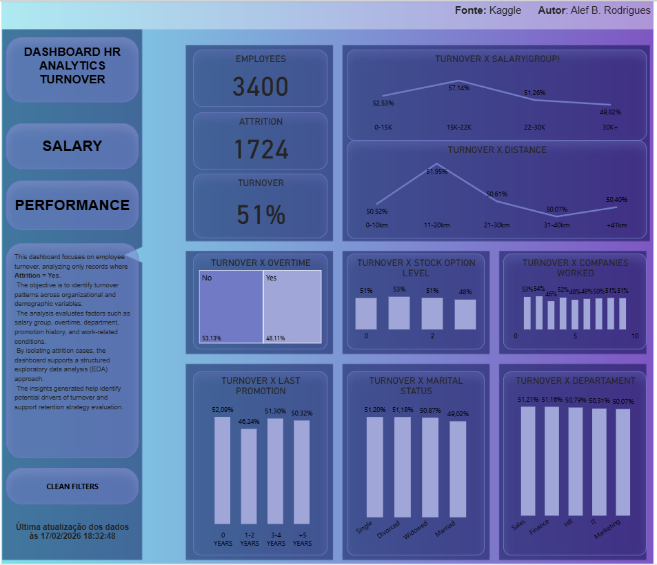
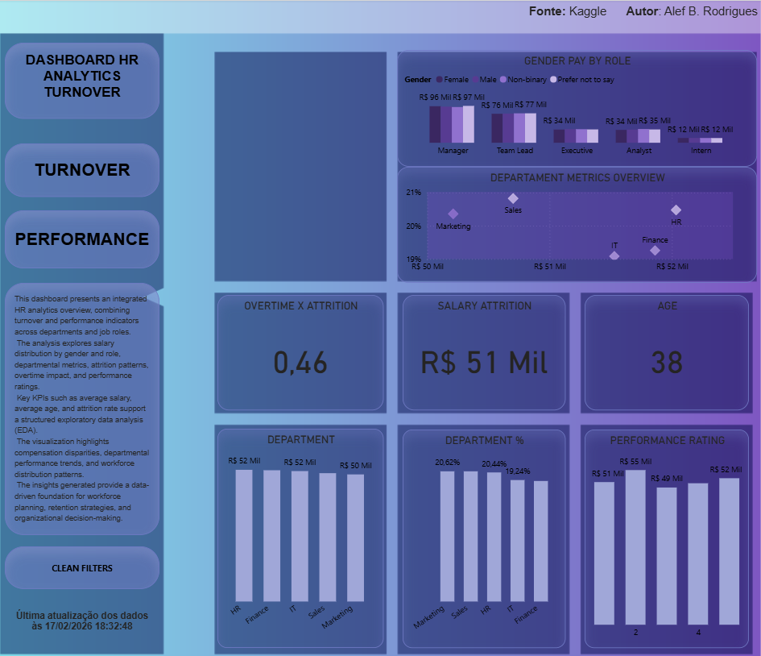
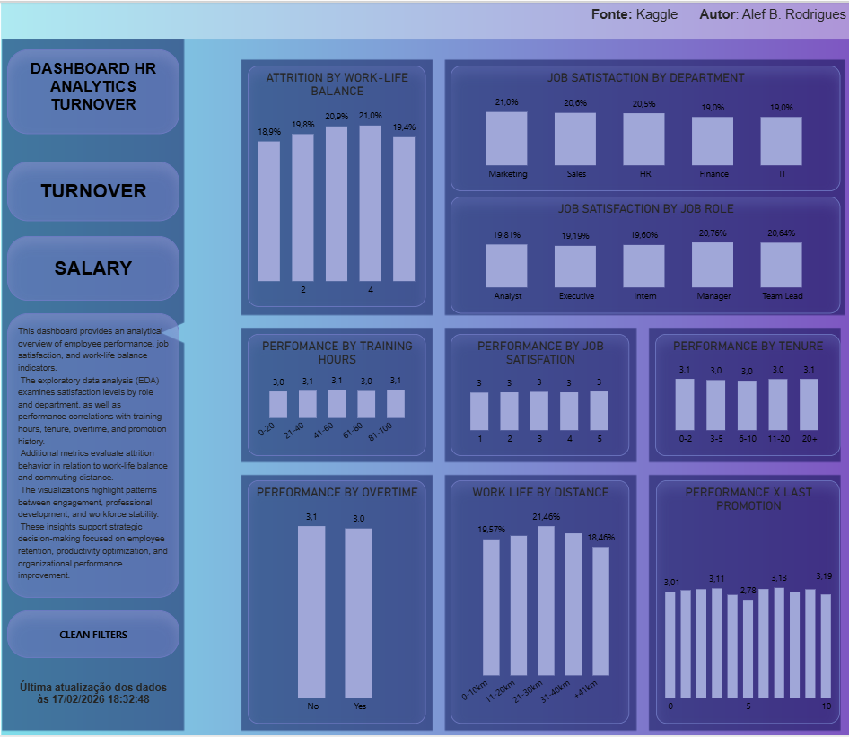

📊 HR Analytics Dashboard – Power BI Project
📌 Project Overview

This project consists of a complete HR Analytics Dashboard developed in Power BI, designed to explore workforce patterns, turnover behavior, compensation structure, and employee performance indicators.

The solution was built following a structured Business Intelligence approach, covering data preparation, modeling, exploratory data analysis (EDA), KPI creation, and executive-level visualization design.

🔎 Analysis Scope

The dashboard explores the following analytical dimensions:

Turnover distribution (Attrition = Yes focus page)

Salary analysis by Gender, Department, and Job Role

Performance vs Tenure

Performance vs Training Hours

Job Satisfaction by Role and Department

Attrition Rate and Volume by Work-Life Balance

Department-level workforce metrics (Headcount, Attrition, Avg Salary)

Overtime impact analysis

Promotion and Stock Option influence

The objective is to identify structural workforce patterns and potential drivers of employee attrition.

📊 Types of Comparisons Performed

Metric by Category (e.g., Performance by Tenure)

Comparative analysis (e.g., Salary by Gender and Role)

Distribution analysis (e.g., Attrition by Department)

Correlation-style exploration (e.g., Performance vs Training Hours)

Concentration analysis (e.g., Turnover by Salary Group)

🛠 Methods & Technical Implementation

The project includes:

Data cleaning and transformation

Creation of calculated columns

Development of DAX measures (KPIs and analytical metrics)

Percentage calculations (Attrition Rate, % Distribution)

Aggregations (Average, Count, Grouping logic)

Segmentation analysis

A dedicated “Measures Table” was created to centralize and organize all DAX measures, improving model structure and dashboard maintainability.

📑 Dashboard Structure

The report is divided into three analytical pages:

Turnover Analysis (Attrition = Yes)

Compensation & Department Overview

Performance & Satisfaction Analysis

Navigation buttons were created to enable smooth switching between the three pages, improving usability and user experience.

🎨 Design & Layout

Color palette aligned with the selected wallpaper/theme

Clean KPI cards for executive readability

Consistent “Metric by Dimension” naming standard

Structured visual hierarchy to support decision-making

A dynamic Last Update indicator was implemented to display the most recent data refresh timestamp, ensuring transparency and reliability.

📈 Key Features

Structured exploratory data analysis (EDA)

End-to-end BI development

KPI engineering

Workforce segmentation

Executive-ready visualization design

📷 Dashboard Preview

Below are the three dashboard pages included in this project:

